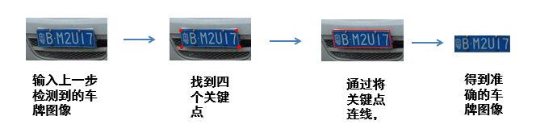
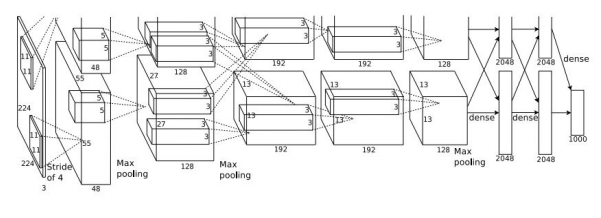
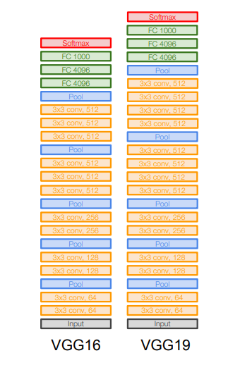
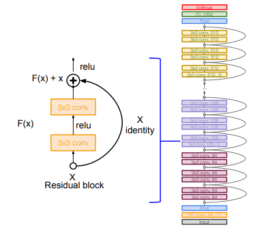
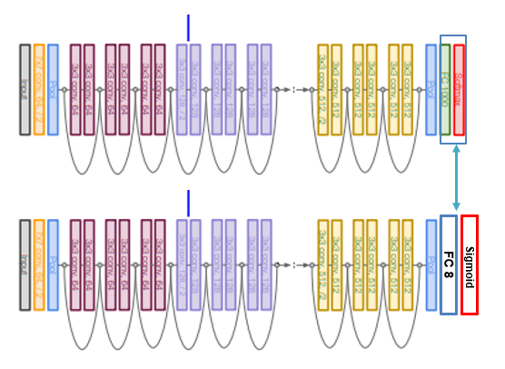
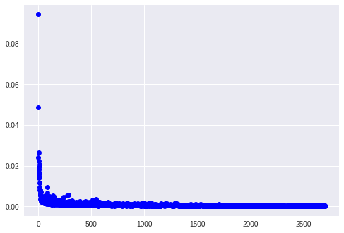
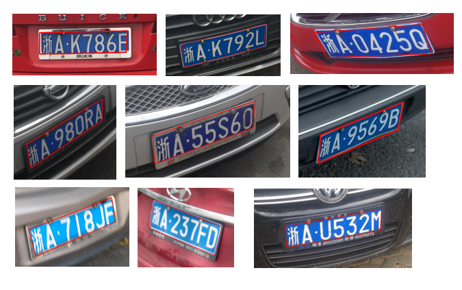
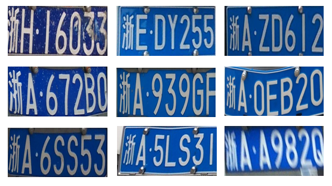

# 基于ResNet的车牌精确定位

2017年做的第一个project，放出来纪念一下。

## 实验任务

本次实验要解决的问题是*车牌检测与识别project*中的一个子问题——车牌精确定位。在获得初步检测并裁剪的车牌图像的基础上进行精确的定位，具体的目标是获得车牌四个角的精确坐标，并进行裁剪和变换，输出准确的车牌图像。

## 思考过程

- 车牌检测问题是一个比较老的问题，网上搜索ANPR（Automatic number-plate recognition)算法可以得到许多的结果，其中对于车牌定位这一部分，基本都是采用Sobel算子来检测垂直和水平边缘的方法。这些传统机器学习的方法已经能在这个问题上起到非常好的效果，但我最近在学习一些深度学习的知识，希望能在卷积神经网络的基础上对这个问题进行研究。

- 在学习Andrew Ng的深度学习课程的时候，Andrew Ng讲解了一种简单的定位脸部特征点的方法，以特征点的（x, y）坐标（先除以图片的size，限制在0~1之间）为目标输出，训练神经网络获得自动识别特征点的能力。这个方法启发了我，因为车牌的定位实际上就是四个特征点的定位，两者的本质上是一样的。

- 对于这个问题，神经网络的架构显然是十分重要的，而且由于实验的数据量比较少（1000个样本），因此我希望能在已有卷积神经网络上进行fine-tune。我上网查找了一些目前比较流行的卷积网络架构，包括AlexNet、VGGNet和ResNet，这些网络在ImageNet数据集上都有着不错的表现。

### AlexNet

AlexNet是首个在ImageNet数据集上获得较好效果的网络架构，总共由五层卷积层和三层FC层构成，有35K个参数。我并没有选择这个网络，这个是一个在2012年发表的网络架构，后面有效果更好的网络可以使用。

### VGGNet

VGGNet是在2014年提出的卷积网络架构，由3层FC层和13层卷积层（VGG16）构成，整个网络有很强的对称性和规律性，可以提取出不同level层次的特征。利用VGGNet的一些特征层可以完成图像风格转换（Image Style [Transfer Using Convolutional Neural Networks](https://www.cv-foundation.org/openaccess/content_cvpr_2016/papers/Gatys_Image_Style_Transfer_CVPR_2016_paper.pdf)）的任务。但是一个VGG16 Net 有138M个参数，这对于只有1000个训练样本的任务来说太多了，因此我放弃了这个选择。

### ResNet

ResNet是由一个个的残差块（Residual block）组成，每个残差块通过学习一个恒等关系（identity）的方式解决在深度神经网络中出现的梯度消失和梯度爆炸的问题，目前是在ImageNet上表现最好的一个模型。和VGGNet相比，ResNet使用的参数较少，而且有更好的表现，因此本次的任务我选择了ResNet模型。

## 实验环境

- 系统环境：使用Google Colab 免费提供的云服务，Linux系统，有GPU加速
- GPU：Tesla K80 GPU
- 开发语言：Python3.6
- 深度学习框架：PyTorch 0.3
> - 学习使用Colab的教程：[Google Colab Free GPU Tutorial](https://medium.com/deep-learning-turkey/google-colab-free-gpu-tutorial-e113627b9f5d)
> - PyTorch是一个最近推出的深度学习框架，虽然相比于TensorFlow、Caffe等社区较小，但上手难度较低，且支持动态计算图的构建。PyTorch的学习参考了官方的[PyTorch Tutorial](http://pytorch.org/tutorials/)。

## 实验内容
### 网络模型

采用的模型在ResNet-18的基础上改进，把最后两层的FC-1000和Softmax层替换成FC-8 和 Sigmoid层，有8个输出，分别代表车牌上四个特征点的 (x, y) 坐标，通过sigmoid函数rescale至 (0， 1) 的范围内

### 损失函数（Loss function）

采用普通的均方误差（Mean Square Error），计算所有特征点的均方误差

### 优化方法

使用Adam梯度下降法，学习速率设为0.001，β1=0.9， β2=0.99，weight_decay=0， ε=1e-08

### 数据集

- 使用蔡老师提供的精确定位的数据集，把1000个样本分为训练集和测试集，训练集有900个样本，测试集有100个样本。
- 训练之前把每一张图像rescale至[224, 224, 3]，rgb色值转换至(0, 1)的区间，用ImageNet数据集的均值和标准差进行Normalization

### 图像裁剪和转换

图像的裁剪和转换是使用opencv里的透视变换函数，通过三维空间的旋转变换获得精确的车牌，参考了一篇博客：[Python下opencv使用笔记（三）（图像的几何变换）](http://blog.csdn.net/on2way/article/details/46801063)

## 训练过程

> 下图为30个epoch，每个epoch有90个batch，总共2700次训练时的loss

batch-size设为10，采用900个训练样本，迭代了30个epoch，最后选取了在测试集上表现最好一个epoch的参数（以MSE loss 为评判标准）

## 实验结果

### 裁剪变换之前

> 随机选取9张

### 裁剪变换后

> 随机选取9张

## 改进与优化

- 采用一些Data Augmentation的方法扩增数据集，如随机裁剪（Random Crop），色调改变等
> 曾经试过利用随机裁剪边缘像素的方式扩增数据集，但是效果不是很理想，反而比原来的效果差
- 可以人为的生成车牌号码，在一篇文章[Number plate recognition with Tensorflow](https://matthewearl.github.io/2016/05/06/cnn-anpr/)该中，作者采用图片组合、增加噪音的方式生成数据集，不过由于本人在图片处理方面知识和代码能力的不足，无法复现文章中的效果。
- 尝试更多网络模型，如GoogLeNet；还有尝试增加全连接层的层数等
